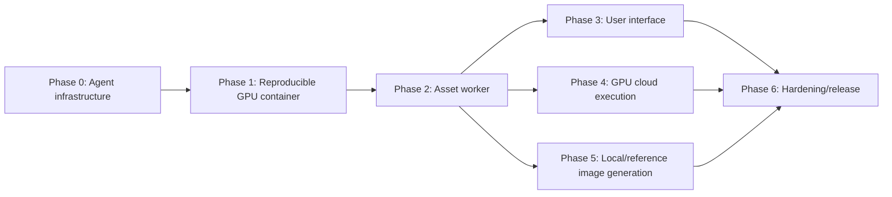

# Pharaon Asset Factory Roadmap

Pharaon Asset Factory is planned as a reproducible game-asset generation pipeline. This roadmap describes intended work, not current functionality. Tickets should normally be small enough for one worker to implement and validate in one focused session.

## Phase dependencies

Phase boundaries may overlap through small exploratory tickets, but production integrations should respect these dependencies.

## Phase 0 — Agent infrastructure

- Repository conventions and ticket schema
- Baseline CI
- Worker workflow
- Reviewer workflow
- Orchestrator state machine backed by GitHub state

## Phase 1 — Reproducible GPU container

- CUDA/Python base image
- Hunyuan dependencies
- Compiled CUDA and rendering extensions
- Runtime health check
- External model cache
- GHCR publishing

## Phase 1 completion

Phase 1 is complete. T-0017's first controlled GHCR publication failed and is
`SUPERSEDED`, not `DONE`. T-0018 fixed the stale `$LASTEXITCODE` blocker, and T-0019
completed the separately approved successful immutable SHA-only GHCR publication.
Phase 2 — Asset worker is the next phase; model weights and inference remain
unimplemented.

## Phase 2 — Asset worker

- Hunyuan shape generation
- Hunyuan texture generation
- Game-ready post-processing and GLB export
- Configuration and metadata report
- ZIP packaging
- CLI/API interface

## Phase 3 — User interface

- Local web application
- Image upload
- Prompt and asset configuration
- Progress and logging
- Asset preview
- Result download

## Phase 4 — GPU cloud execution

- Provider abstraction
- Vast.ai offer discovery
- Cost estimation and hard spending limits
- Instance provisioning
- Health checks and job execution
- Artifact retrieval and guaranteed teardown
- Infrastructure failure classification and handling

## Phase 5 — Local/reference image generation

- Local image model
- RTX 4060 8 GB-compatible mode where practical
- Reference image generation
- End-to-end pipeline integration

## Phase 6 — Hardening/release

- Security and secret handling
- Crash recovery
- Cost accounting
- Integration tests
- User and operator documentation
- v1 release
