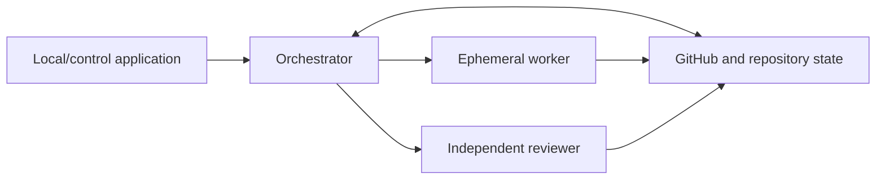
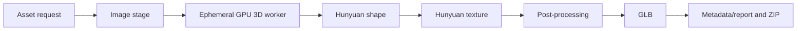
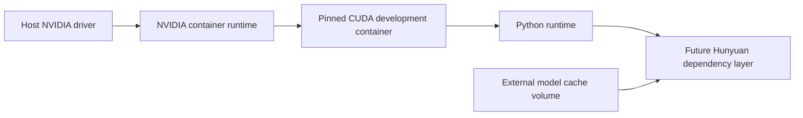

# Architecture Overview

This document describes the intended long-term system. Most components shown here are not implemented yet.

## Persistent control plane

Agents are ephemeral; project state is persistent and inspectable. The local control application will select work through an orchestrator, while GitHub issues, pull requests, labels, CI results, and repository files remain the source of truth.

The orchestrator should be restartable from repository and GitHub state. A worker handles one ticket and cannot approve or merge its own work. A reviewer applies the ticket's existing acceptance criteria without rewriting them.

## Asset data plane

An asset request will contain a prompt and/or reference image plus bounded configuration. The image stage may preserve an uploaded reference or generate one. The containerized GPU worker will produce geometry and texture, followed by deterministic post-processing, validation, GLB export, metadata, and packaging.

GPU workers should eventually be ephemeral and provider-independent at the job boundary. Models and large caches should live outside the disposable container filesystem. Job inputs, outputs, status, and failure classification should use stable interfaces so a local GPU or a rented provider such as Vast.ai can be substituted without changing the asset pipeline.

The Phase 1 runtime boundary is:

The host driver exposes GPUs to pinned CUDA userspace through NVIDIA Container Toolkit; the host CUDA toolkit does not need to match the container toolkit. Application code lives under `/app`, while model weights remain outside the image under the separately mounted `/models` cache boundary. See [ADR 0002](decisions/0002-containerized-cuda-runtime.md).

## Architectural boundaries

- The control plane schedules and records work; it does not contain GPU model logic.
- The asset worker owns generation and packaging behind a CLI/API contract.
- Provider adapters own provisioning and teardown, not pipeline behavior.
- Durable artifacts must be retrieved and verified before an ephemeral instance is destroyed.
- Security and cost policies are enforcement boundaries, not advisory UI settings.
