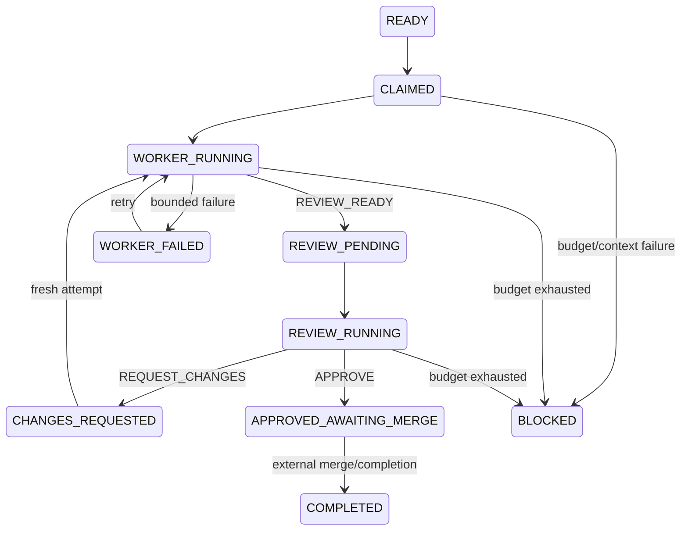

# Orchestrator state machine

The orchestrator is a disposable, deterministic coordinator. It selects eligible
tickets, persists an atomic claim and workflow state, dispatches through the existing
T-0003/T-0004 contracts, and reconciles observable evidence after restart. It is not
an implementation worker, reviewer, merge bot, daemon, model provider, or cloud
resource controller.

## State and transitions



`WorkflowState.transition` contains the complete legal transition table and rejects
every other edge. Each transition appends concise audit evidence; hidden reasoning is
never stored. The canonical ticket status remains coarse:

- `READY` maps to internal `READY`.
- claim/worker/change stages map to `IN_PROGRESS`.
- review and approved-awaiting-merge stages map to `REVIEW`.
- terminal failure maps to `BLOCKED`.
- only external completion maps to `DONE`.

Approval never merges a PR and does not itself mark the ticket `DONE`.

## Selection, persistence, and claims

Eligibility requires `READY`, existing `DONE` dependencies, valid repository metadata,
and no active claim. Selection is ascending `priority` (1 is highest), then ticket ID.
Filesystem enumeration order is irrelevant.

`RepositoryStateBackend` stores JSON claims, workflow state, and observable worker and
reviewer evidence under `.orchestration/`. Claim creation uses an exclusive-create
operation, so two processes sharing a checkout cannot both acquire the ticket. State
writes use revision compare-and-set plus atomic replacement. `InMemoryBackend` models
the same semantics under a lock for tests. A future GitHub adapter should implement the
same `StateBackend` boundary using issue/PR metadata and provider compare-and-set; no
database or distributed lock service is required. The local adapter is deliberately
scoped to one shared checkout and does not pretend to coordinate independent clones.

Repository/GitHub evidence remains authoritative. A restarted process loads state and
evidence again. A stale worker/reviewer-running stage advances if its persisted result
exists; a process recorded as gone without a result follows the bounded infrastructure
path; external merge/completion reaches `COMPLETED` without redispatch.

## Dispatch and retry policy

`WorkerDispatcher` receives the exact `WorkerContext`, attempt number, identity, claim
token, and all persisted actionable review feedback. It returns T-0003 `AttemptResult`.
The canonical branch and PR reference remain unchanged across requested-change cycles.
`ReviewerDispatcher` receives a T-0004 `ReviewerContext` reconstructed from the ticket,
worker attempt, PR/diff, CI, and prior comments. Equal worker/reviewer identities are
rejected before dispatch.

Defaults are three implementation attempts, two infrastructure retries, and two
reviewer execution retries. All are configurable positive finite limits.
Infrastructure retries do not consume implementation attempts. Implementation,
validation, reviewer-execution, and infrastructure failures remain separately audited;
exhaustion produces `BLOCKED` for human attention.

No concrete dispatcher, LLM SDK, paid API, GPU, or cloud provider is included. Adding
one requires a later approved integration and cost policy. There is no merge method.

## Run once

```bash
python -m orchestrator.cli list-ready
python -m orchestrator.cli run-once --owner github-run-123
python -m orchestrator.cli show-state T-0010
```

One invocation performs at most one claim, dispatch, or reconciliation step. Without a
configured dispatcher, `run-once` reports the required boundary action and does not
invent a provider or loop. A future GitHub Action or service can invoke `run-once`
repeatedly in response to repository events.
